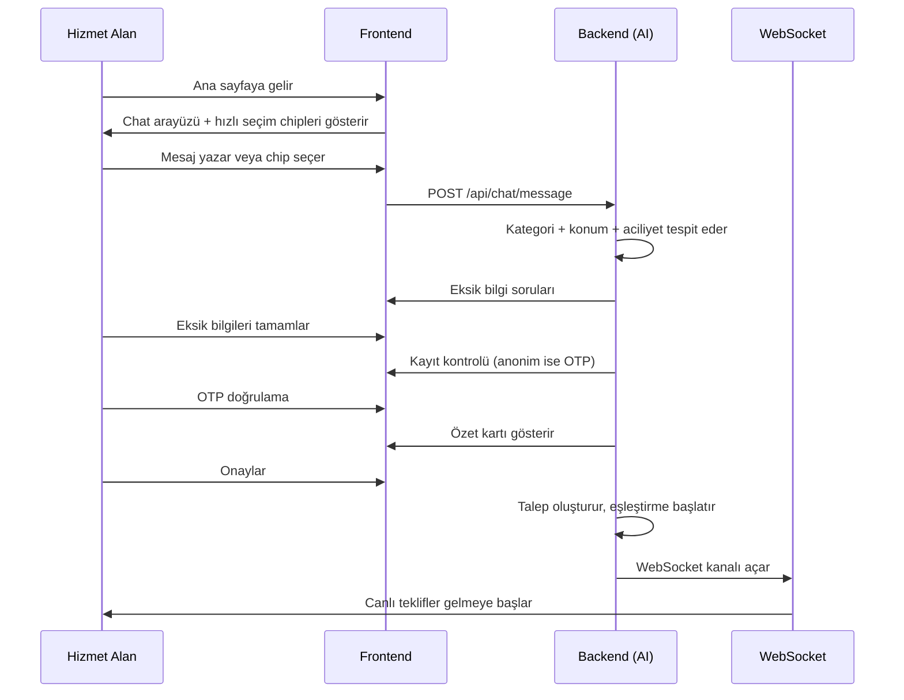

> Kullanıcının ana sayfaya gelişinden AI destekli sohbet ile hizmet talebi oluşturmasına kadar olan uçtan uca akış.

## PRD Bölümleri

- [§3.1 Akıllı Chat Arayüzü](../../esnaaf-claude.md)
- [§3.2 Chat Akış Detayları](../../esnaaf-claude.md)

## Aktörler

| Aktör | Rol |
|---|---|
| [[Hizmet-Alan]] | Chat'e yazan, talep oluşturan kullanıcı |
| AI Chat Servisi | Backend'de çalışan OpenAI + LangChain tabanlı servis |

## Tetikleyici

Kullanıcı ana sayfaya gelir → chat alanına mesaj yazar.

## Akış Adımları



### Adım Detayları

| # | Adım | Açıklama |
|---|---|---|
| 1 | **Ana Sayfa** | Kullanıcı sayfaya gelir, chat alanı ve [[Hızlı-Seçim-Chipleri]] görünür |
| 2 | **Kullanıcı Yazar** | Serbest metin veya chip ile kategori seçimi |
| 3 | **AI Kategori Tespiti** | GPT kategori, konum ve aciliyet seviyesini analiz eder |
| 4 | **Eksik Bilgi Toplama** | AI eksik alanları sırayla sorar (ne, nerede, ne zaman, detay) |
| 5 | **Kayıt Kontrolü** | Anonim kullanıcı → [[OTP-Kayıt-Akışı]] tetiklenir |
| 6 | **Özet Kartı** | Tüm bilgiler form kartı olarak gösterilir → [[Form-Özeti-Akışı]] |
| 7 | **Onay** | Kullanıcı "Onayla" butonuna basar |
| 8 | **Canlı Teklifler** | WebSocket üzerinden HV teklifleri gerçek zamanlı gelir |

## State Machine

```
greeting → category_detection → collecting_details → ask_name → ask_phone → otp_verification → confirm_form → completed
```

| State | Açıklama | Sonraki State |
|---|---|---|
| `greeting` | Hoş geldin mesajı, chip'ler gösterilir | `category_detection` |
| `category_detection` | AI mesajı analiz eder, kategori belirler | `collecting_details` |
| `collecting_details` | Eksik bilgiler sırayla sorulur | `ask_name` |
| `ask_name` | Kullanıcı adı istenir | `ask_phone` |
| `ask_phone` | Telefon numarası istenir | `otp_verification` |
| `otp_verification` | OTP kodu gönderilir ve doğrulanır | `confirm_form` |
| `confirm_form` | Özet kart gösterilir, onay beklenir | `completed` |
| `completed` | Talep oluşturuldu, teklifler bekleniyor | — |

> **Not:** Kayıtlı kullanıcılar `ask_name` → `ask_phone` → `otp_verification` adımlarını atlar, doğrudan `confirm_form`'a geçer.

## Hata Senaryoları

| Senaryo | Davranış |
|---|---|
| AI yanıt vermezse | 3 saniye sonra retry, 2. başarısızlıkta "Teknik bir sorun oluştu" mesajı |
| Kategori tespit edilemezse | Kategori listesi gösterilir, kullanıcı manuel seçer |
| Session timeout (2 saat) | Anonim session sona erer, yeni chat başlatılır |
| OTP doğrulama başarısız | [[OTP-Kayıt-Akışı]] hata senaryoları devreye girer |
| Kullanıcı chat'i terk ederse | [[Anonim-Chat-Akışı]] — veriler Redis'te 2 saat saklanır |

## PII İzolasyonu

Chat mesajlarında [[PII-İzolasyonu]] uygulanır:

- Telefon numarası chat geçmişine yazılmaz
- Kişisel bilgiler ayrı encrypted alanda saklanır
- AI'a gönderilen prompt'larda PII maskelenir

## İlgili Sayfalar

- [[M2-AI-Chat-Talep]]
- [[Anonim-Chat-Akışı]]
- [[OTP-Kayıt-Akışı]]
- [[Form-Özeti-Akışı]]
- [[Hızlı-Seçim-Chipleri]]
- [[PII-İzolasyonu]]
- [[Talep-Yaşam-Döngüsü]]
