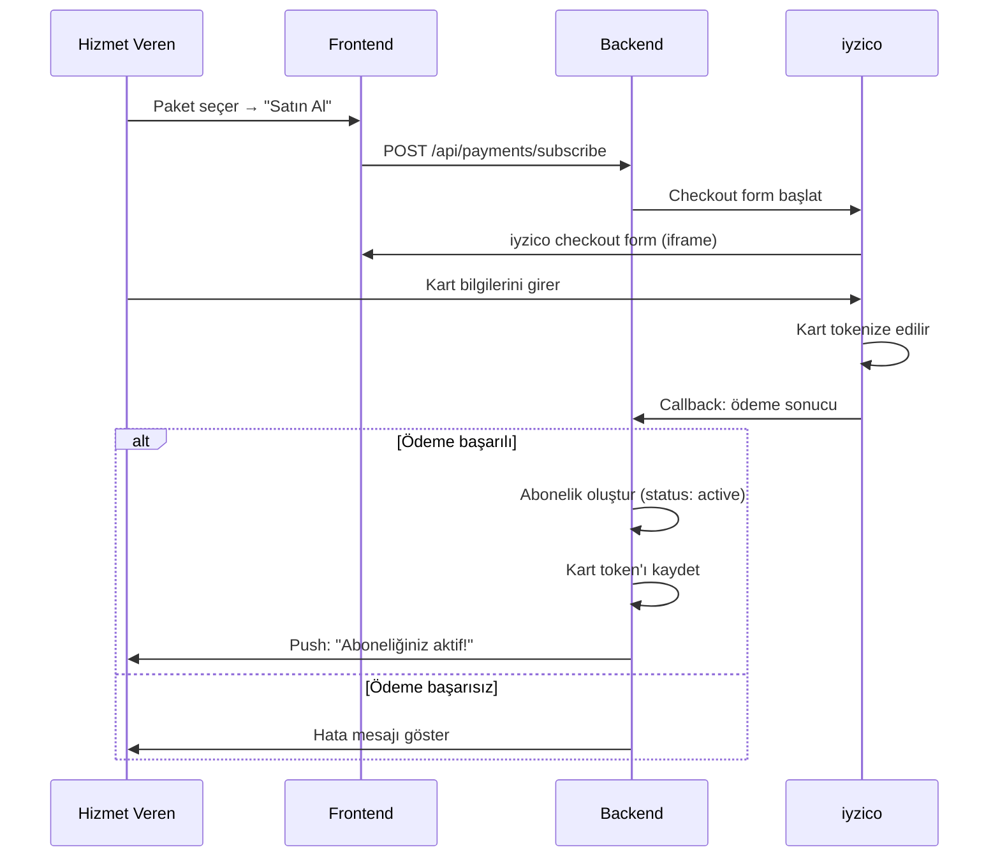
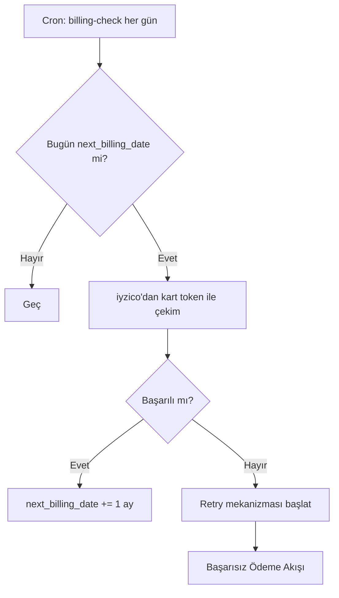

> Hizmet verenin abonelik satın alması, iyzico üzerinden kart tokenize edilmesi, ilk ödeme ve aylık tekrarlayan ödeme akışı.

## PRD Bölümleri

- [§7.1 Abonelik Modeli](../../esnaaf-claude.md)
- [§7.2 Ödeme Entegrasyonu](../../esnaaf-claude.md)

## Aktörler

| Aktör | Rol |
|---|---|
| [[Hizmet-Veren]] | Abonelik satın alan firma |
| Backend (Ödeme Servisi) | iyzico entegrasyonu, abonelik yönetimi |
| iyzico | Ödeme altyapısı sağlayıcı |

## Tetikleyici

HV, paket seçim sayfasında bir abonelik planı seçer ve "Satın Al" butonuna basar.

## İlk Ödeme Akışı

### Adım Detayları

| # | Adım | Açıklama |
|---|---|---|
| 1 | **Paket Seçimi** | HV mevcut paketlerden birini seçer |
| 2 | **Checkout Form** | iyzico checkout formu iframe olarak gösterilir |
| 3 | **Kart Bilgileri** | HV kart bilgilerini girer (PCI DSS uyumlu — backend kart bilgisi görmez) |
| 4 | **Tokenizasyon** | iyzico kartı tokenize eder, token backend'e döner |
| 5 | **İlk Çekim** | İlk aylık ödeme alınır |
| 6 | **Abonelik Aktif** | `subscriptions` tablosunda kayıt oluşur, `next_billing_date` set edilir |

## Aylık Tekrarlayan Ödeme

### Başarılı Tekrarlayan Ödeme

1. Cron job `next_billing_date` = bugün olan abonelikleri bulur
2. iyzico'dan saklı kart token'ı ile ödeme çekilir
3. Başarılı → `next_billing_date` 1 ay ileri alınır
4. HV'ye bildirim: "Aylık ödemeniz alındı"

## Başarısız Ödeme Retry Mekanizması

3 deneme, 6 gün boyunca:

| Deneme | Gün | Davranış |
|---|---|---|
| 1. deneme | Ödeme günü | İlk çekim başarısız → HV'ye bildirim |
| 2. deneme | +2 gün | Tekrar dener → başarısız → HV'ye uyarı |
| 3. deneme | +4 gün (toplam 6. gün) | Son deneme → başarısız → abonelik askıya alınır |

### Askıya Alma

3 deneme de başarısız olursa:

1. Abonelik `status: suspended` olur
2. HV teklif gönderemez
3. HV'ye bildirim: "Aboneliğiniz askıya alındı. Ödeme bilgilerinizi güncelleyin."
4. Admin panelde uyarı oluşur
5. Detaylar: [[Başarısız-Ödeme-Akışı]]

## Abonelik Statüleri

| Statü | Açıklama |
|---|---|
| `active` | Abonelik aktif, HV teklif gönderebilir |
| `suspended` | Ödeme başarısız, teklif gönderme engelli |
| `cancelled` | HV veya admin tarafından iptal edilmiş |
| `trial` | Deneme süresi (admin tarafından verilir) |
| `expired` | Süre dolmuş, yenilenmemiş |

## İptal Akışı

| İptal Eden | Davranış |
|---|---|
| HV (kendi isteği) | Dönem sonuna kadar aktif, yenilenmez |
| Admin | Anında veya dönem sonunda iptal seçeneği |
| Sistem (3 başarısız ödeme) | Otomatik askıya alma → iptal |

## İlgili Sayfalar

- [[M4-Ödeme-Kampanya]]
- [[Başarısız-Ödeme-Akışı]]
- [[Hizmet-Veren]]
- [[M6-Admin-Roller]]
