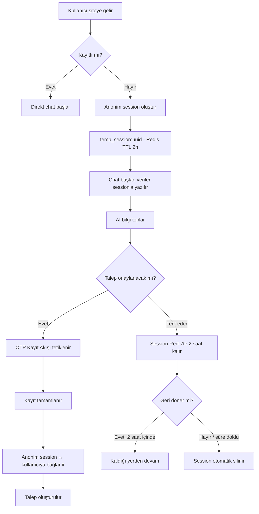

> Kayıtsız kullanıcının chat ile etkileşime geçmesi, anonim session'da verilerinin saklanması ve talep onayı anında kayıt sürecine yönlendirilmesi akışı.

## PRD Bölümleri

- [§1.4.2 Anonim Kullanıcı](../../esnaaf-claude.md)
- [§3.1 Akıllı Chat Arayüzü](../../esnaaf-claude.md)

## Anonim Session Yapısı

Kayıtsız kullanıcılar için Redis'te geçici oturum oluşturulur:

```
Key:    temp_session:{uuid}
TTL:    2 saat (7200 saniye)
```

### Session İçeriği

```json
{
  "session_id": "uuid-v4",
  "created_at": "2026-05-24T10:00:00Z",
  "chat_history": [
    { "role": "assistant", "content": "Merhaba! Size nasıl yardımcı olabilirim?" },
    { "role": "user", "content": "Boya badana yaptırmak istiyorum" }
  ],
  "detected_category": "boya-badana",
  "detected_location": null,
  "collected_details": {},
  "state": "collecting_details"
}
```

## Akış



### Adım Detayları

| # | Adım | Açıklama |
|---|---|---|
| 1 | **Site Ziyareti** | Kullanıcı ana sayfaya gelir, JWT token yoksa anonim kabul edilir |
| 2 | **Session Oluşturma** | `temp_session:{uuid}` Redis key'i oluşturulur (TTL: 2 saat) |
| 3 | **Chat Etkileşimi** | Tüm chat mesajları ve AI tespitleri session'a yazılır |
| 4 | **Bilgi Toplama** | AI kategori, konum, detay gibi bilgileri toplar |
| 5 | **Kayıt Yönlendirme** | Talep onayı anında [[OTP-Kayıt-Akışı]] inline tetiklenir |
| 6 | **Session Bağlama** | Kayıt sonrası anonim session verileri yeni kullanıcıya aktarılır |
| 7 | **Talep Oluşturma** | Chat'te toplanan verilerle talep otomatik oluşturulur |

## Kayıtlı Kullanıcı Davranışı

Kayıtlı kullanıcılar bu akışı **atlar**:

- JWT token mevcutsa → anonim session oluşturulmaz
- Doğrudan [[AI-Chat-Akışı]]'ndaki `greeting` state'inden başlar
- Kayıt ve OTP adımları gereksiz — `confirm_form`'a direkt geçilir

## Terk Senaryosu

| Durum | Davranış |
|---|---|
| Kullanıcı tarayıcıyı kapatır | Session Redis'te yaşamaya devam eder |
| 2 saat içinde geri dönerse | Cookie'deki session_id ile eşleştirilir, kaldığı yerden devam |
| 2 saat geçerse | Redis TTL sona erer, session silinir, yeni chat başlar |
| Farklı cihazdan gelirse | Yeni anonim session oluşur (cookie paylaşılmaz) |

## Teknik Notlar

- Session ID, tarayıcıda `httpOnly` cookie olarak saklanır
- Redis `temp_session:*` key pattern'i ile anonim session'lar izlenebilir
- Session → kullanıcı bağlama işlemi atomik olmalı (transaction)
- Chat history, kayıt sonrası `chat_sessions` ve `chat_messages` tablolarına taşınır

## İlgili Sayfalar

- [[AI-Chat-Akışı]]
- [[OTP-Kayıt-Akışı]]
- [[Anonim-Session]]
- [[M1-Auth-Kullanıcı]]
- [[M2-AI-Chat-Talep]]
