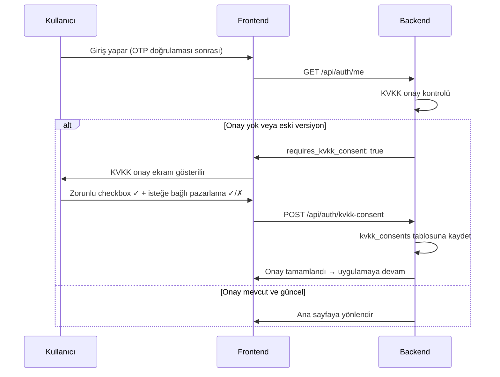

> İlk giriş sonrası zorunlu KVKK (Kişisel Verilerin Korunması Kanunu) onay sürecinin yönetimi — kullanıcı onay vermeden uygulamayı kullanamaz.

## PRD Bölümleri

- [§12.1 KVKK & Hukuki Uyumluluk](../../esnaaf-claude.md)

## Aktörler

| Aktör | Rol |
|---|---|
| [[Hizmet-Alan]] / [[Hizmet-Veren]] | Onay veren kullanıcı |
| Backend (Auth Servisi) | Onay kaydı ve kontrol |

## Tetikleyici

Kullanıcı ilk kez kayıt olur veya KVKK metni güncellendiğinde giriş yapar.

## Akış



## KVKK Onay Ekranı

```
┌─────────────────────────────────────────────────┐
│  Kişisel Verilerin Korunması                    │
│                                                 │
│  Esnaaf uygulamasını kullanabilmeniz için        │
│  aşağıdaki metinleri okumanız ve onaylamanız    │
│  gerekmektedir.                                 │
│                                                 │
│  📄 KVKK Aydınlatma Metni [Oku →]              │
│  📄 Açık Rıza Metni [Oku →]                    │
│                                                 │
│  ☐ KVKK Aydınlatma Metni'ni okudum ve           │
│    kabul ediyorum. (ZORUNLU)                    │
│                                                 │
│  ☐ Kampanya ve bilgilendirme mesajları           │
│    almak istiyorum. (İSTEĞE BAĞLI)             │
│                                                 │
│  [Devam Et]                                     │
└─────────────────────────────────────────────────┘
```

## Onay Kuralları

| Kural | Detay |
|---|---|
| KVKK Aydınlatma Metni | **Zorunlu** — checkbox işaretlenmeden devam edilemez |
| Açık Rıza (Pazarlama) | **İsteğe bağlı** — işaretlenmese de devam edilebilir |
| Engelleme | Zorunlu onay verilmezse uygulama **kullanılamaz** |
| Versiyon takibi | KVKK metni güncellenirse kullanıcı tekrar onay verir |
| Geri çekilme | Kullanıcı pazarlama onayını her zaman geri çekebilir |

## DB Kaydı

`kvkk_consents` tablosuna yazılan kayıt:

```json
{
  "user_id": "uuid",
  "consent_type": "kvkk_aydinlatma",
  "version": "2026-05-01",
  "given_at": "2026-05-24T10:30:00Z",
  "ip_address": "192.168.1.1",
  "user_agent": "Mozilla/5.0...",
  "is_active": true
}
```

| Alan | Açıklama |
|---|---|
| `consent_type` | `kvkk_aydinlatma` veya `pazarlama_izni` |
| `version` | Onaylanan metnin versiyonu |
| `given_at` | Onay tarihi/saati |
| `ip_address` | Onay anında kullanıcının IP adresi |
| `user_agent` | Tarayıcı/uygulama bilgisi |
| `is_active` | Onay geçerli mi (geri çekilmiş mi) |

## Metin Güncelleme Durumu

KVKK metni güncellendiğinde:

1. Admin panelden yeni metin versiyonu yayınlanır
2. Tüm kullanıcıların `requires_kvkk_consent` flag'i güncellenir
3. Bir sonraki girişte kullanıcı yeni metni onaylaması istenir
4. Eski onay kaydı `is_active: false` olur, yeni kayıt eklenir

## Pazarlama Onayı Geri Çekme

Kullanıcı ayarlarından pazarlama onayını geri çekebilir:

1. Profil → Ayarlar → Bildirim Tercihleri
2. "Kampanya bildirimleri" toggle kapatılır
3. `kvkk_consents` tablosunda ilgili kayıt `is_active: false` yapılır
4. Pazarlama SMS ve push bildirimleri durdurulur

## KVKK Hakları (md. 11)

Kullanıcının kullanabileceği KVKK hakları:

| Hak | Uygulama Karşılığı |
|---|---|
| Bilgi edinme | Profilde "Verilerim" bölümü |
| Düzeltme | Profil düzenleme |
| Silme / anonimleştirme | Hesap silme (veri anonimleştirme) |
| İtiraz | Destek talebi ile itiraz |
| Taşınabilirlik | Veri dışa aktarma (JSON/CSV) |

## İlgili Sayfalar

- [[M1-Auth-Kullanıcı]]
- [[KVKK-Veri-Saklama]]
- [[OTP-Kayıt-Akışı]]
- [[M6-Admin-Roller]]
