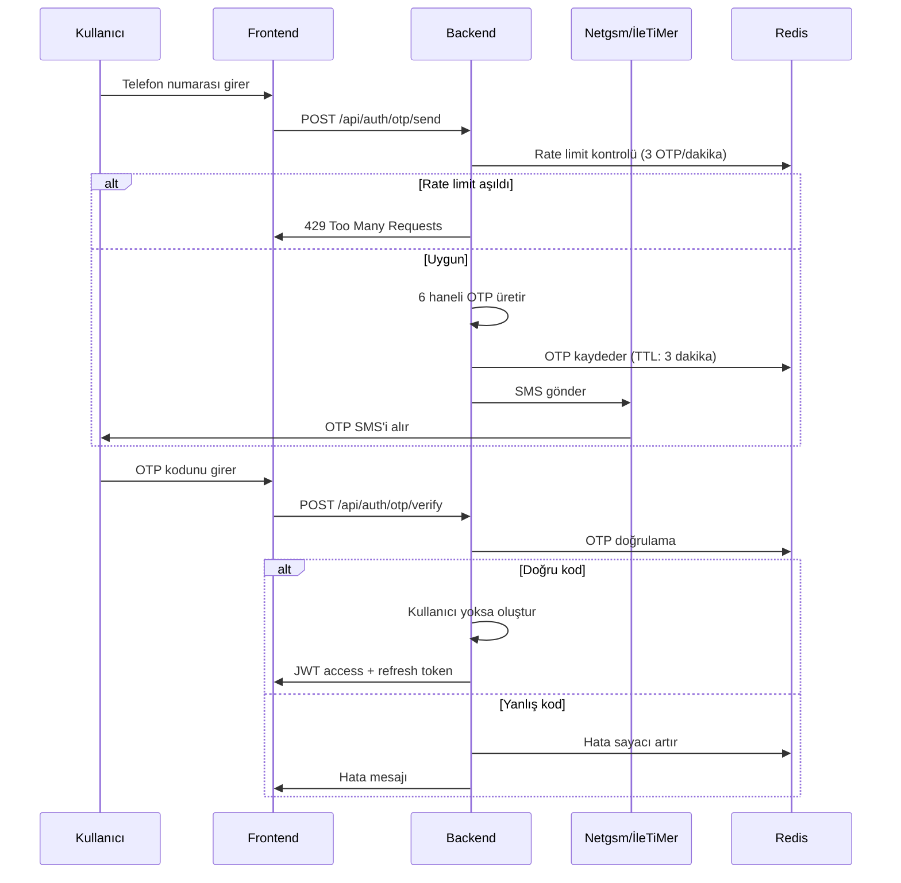

> SMS ile OTP doğrulama kullanarak hızlı kullanıcı kaydı ve giriş akışı.

## PRD Bölümleri

- [§2.1 Üyelik Sistemi](../../esnaaf-claude.md)
- [§17.1 Hata Senaryoları](../../esnaaf-claude.md)

## Aktörler

| Aktör | Rol |
|---|---|
| [[Hizmet-Alan]] / [[Hizmet-Veren]] | Kayıt olan veya giriş yapan kullanıcı |
| Backend (Auth Servisi) | OTP üretimi, doğrulama, JWT token üretimi |
| SMS Provider | Netgsm (birincil), İleTiMer (yedek) |

## Tetikleyici

- Anonim chat akışında talep onayı anında → inline kayıt
- Giriş ekranından telefon numarası girişi

## Akış



## SMS Provider Stratejisi

| Öncelik | Provider | Kullanım |
|---|---|---|
| Birincil | Netgsm | Varsayılan SMS gönderimi |
| Yedek | İleTiMer | Netgsm başarısız olursa otomatik geçiş |

```
Netgsm → başarısız → İleTiMer'e fallback
İleTiMer → başarısız → "SMS gönderilemedi, lütfen tekrar deneyin" mesajı
```

## Rate Limiting

| Kural | Limit | Davranış |
|---|---|---|
| OTP gönderim | 3 / dakika / telefon | 429 hatası döner |
| OTP doğrulama | 5 deneme / OTP | 3. hatalı denemede kilit |
| Telefon bazlı kilit | 5 dakika | Redis `otp_lock:{phone}` key'i |

## Hata Senaryoları

| # | Senaryo | Davranış |
|---|---|---|
| 1 | OTP 1. yanlış giriş | "Kod hatalı. Lütfen tekrar deneyin." |
| 2 | OTP 2. yanlış giriş | "Kod hatalı. Son 1 hakkınız kaldı." |
| 3 | OTP 3. yanlış giriş | ❌ 5 dakika Redis kilidi (`otp_lock:{phone}`, TTL: 300s) |
| 4 | OTP süresi doldu (3 dk) | "Kodun süresi doldu." + otomatik yeni kod gönderilir |
| 5 | SMS gönderilemedi | Netgsm → İleTiMer fallback, ikisi de başarısız → hata mesajı |
| 6 | Geçersiz telefon formatı | 400 → "Geçerli bir telefon numarası girin" |
| 7 | Rate limit aşıldı | 429 → "Çok fazla deneme. Lütfen 1 dakika bekleyin." |

## OTP Kodu Özellikleri

| Özellik | Değer |
|---|---|
| Uzunluk | 6 haneli sayısal |
| Geçerlilik süresi | 3 dakika |
| Depolama | Redis `otp:{phone}` (TTL: 180s) |
| Üretim | Kriptografik olarak güvenli random |

## Kayıt Sonrası

Başarılı OTP doğrulaması sonrası:

1. Kullanıcı `users` tablosunda yoksa → yeni kayıt oluşturulur
2. JWT access token (15 dk) + refresh token (7 gün) üretilir
3. Anonim session varsa → kullanıcıya bağlanır ([[Anonim-Chat-Akışı]])
4. KVKK onay ekranı gösterilir ([[KVKK-Onay-Akışı]])

## İlgili Sayfalar

- [[M1-Auth-Kullanıcı]]
- [[Anonim-Chat-Akışı]]
- [[AI-Chat-Akışı]]
- [[KVKK-Onay-Akışı]]
- [[JWT-Token]]
- [[Rate-Limit]]
