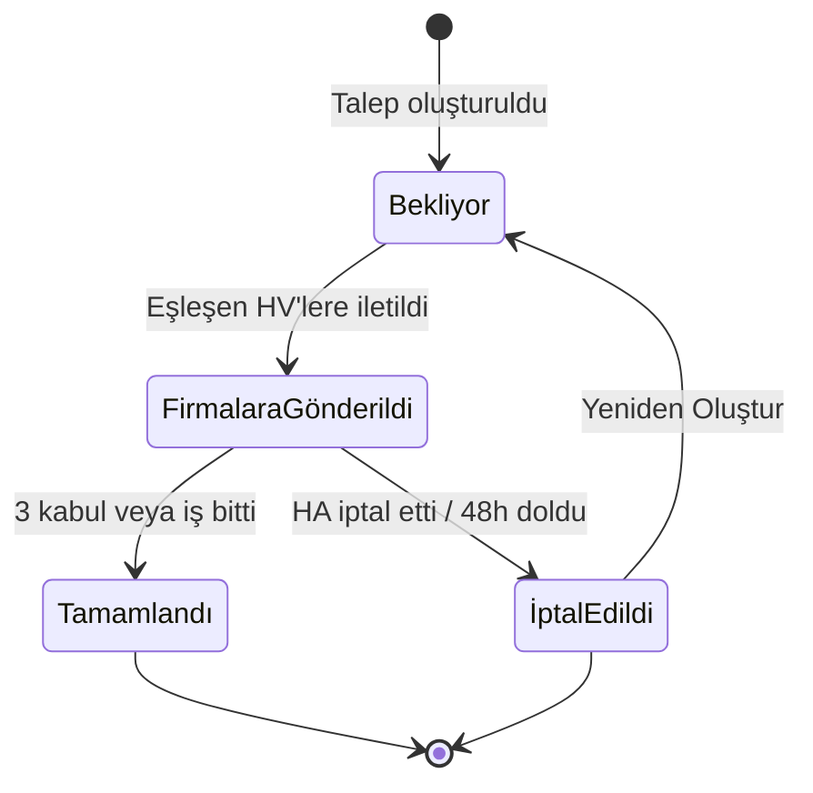

> Hizmet talebinin oluşturulmasından kapanmasına kadar olan yaşam döngüsü — 48 saatlik zaman penceresi, otomatik kapanma ve yeniden oluşturma mekanizmaları.

## PRD Bölümleri

- [§4 Talep Yönetimi](../../esnaaf-claude.md)

## Aktörler

| Aktör | Rol |
|---|---|
| [[Hizmet-Alan]] | Talep oluşturan kullanıcı |
| [[Hizmet-Veren]] | Teklif gönderen firma |
| Cron Job (Backend) | Otomatik kapanma ve bildirim zamanlayıcısı |

## Talep Statüleri



| Statü | Açıklama |
|---|---|
| **Bekliyor** | Talep oluşturuldu, eşleştirme bekliyor |
| **Firmalara Gönderildi** | Uygun HV'lere bildirim gönderildi, teklifler bekleniyor |
| **Tamamlandı** | 3 kabul yapıldı veya iş teyit edildi |
| **İptal Edildi** | HA tarafından iptal veya 48 saat doldu (otomatik) |

## 48 Saatlik Yaşam Döngüsü

Talep oluşturulduktan sonra 48 saatlik bir zaman penceresi başlar:

```
T+0h   → Talep oluşturuldu, HV'lere gönderildi
T+24h  → Kontrol: hiç teklif gelmedi mi?
T+46h  → Kontrol: 2'den az kabul var mı?
T+48h  → Otomatik kapanma (3 kabul yoksa)
```

### Cron Job Bildirimleri

| Zaman | Koşul | Bildirim | Kod |
|---|---|---|---|
| T+24h | Hiç teklif gelmedi | HA'ya "Henüz teklif gelmedi, beklemeye devam ediyoruz" | HA-06 |
| T+46h | 2'den az kabul | HA'ya "Talebiniz için az sayıda firma yanıt verdi" | HA-07 |
| T+48h | 3'ten az kabul | Talep otomatik kapatılır, HA'ya bildirim | — |

### Cron Job Yapısı

```typescript
// BullMQ repeatable job
{
  name: 'request-lifecycle-check',
  repeat: { every: 60000 }, // her dakika çalışır
  data: {}
}
```

## Teklif Akışı Entegrasyonu

| Olay | Etki |
|---|---|
| HV teklif gönderir | Talep "Firmalara Gönderildi" statüsünde kalır |
| HA teklifi kabul eder | Kabul sayacı artar (max 3) |
| 3. kabul yapılır | Kalan bekleyen teklifler → "Değerlendirilmedi" |
| HA iptal eder | Tüm bekleyen teklifler iptal edilir |

## HV Ban Durumu

Bir HV banlandığında aktif teklifleri etkilenir:

| Teklif Durumu | Etki |
|---|---|
| Bekleyen teklif | Otomatik iptal edilir |
| Kabul edilmiş teklif | HA'ya bildirim: "Firma artık hizmet veremiyor" + alternatif HV önerilir |

## Yeniden Oluşturma

İptal edilen talepler **[Yeniden Oluştur]** butonu ile tekrar açılabilir:

1. HA, iptal edilmiş talep detayında "Yeniden Oluştur" butonuna basar
2. Önceki talep bilgileri form olarak gösterilir (düzenlenebilir)
3. HA onaylarsa yeni bir talep oluşturulur (yeni ID)
4. Eski taleple `parent_request_id` ile ilişkilendirilir
5. 48 saatlik süre sıfırdan başlar

## İptal Kuralları

| İptal Eden | Koşul | Davranış |
|---|---|---|
| HA (manuel) | Her zaman iptal edebilir | Bekleyen teklifler iptal, kabul edilenler korunur |
| Sistem (48h) | 3 kabul tamamlanmamış | Otomatik kapanma, HA bilgilendirilir |
| Admin | Uygunsuz talep tespiti | Talep kapatılır, HA bilgilendirilir |

## İlgili Sayfalar

- [[M2-AI-Chat-Talep]]
- [[M3-Eşleştirme-Teklif]]
- [[Teklif-Kabul-Akışı]]
- [[AI-Chat-Akışı]]
- [[Hizmet-Alan]]
- [[Hizmet-Veren]]
