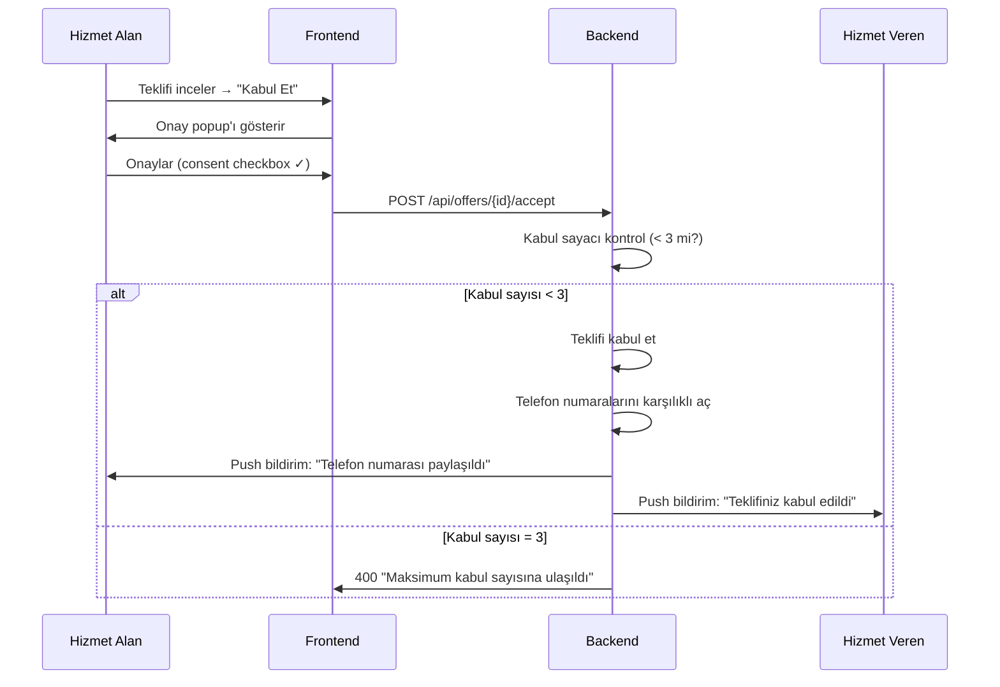
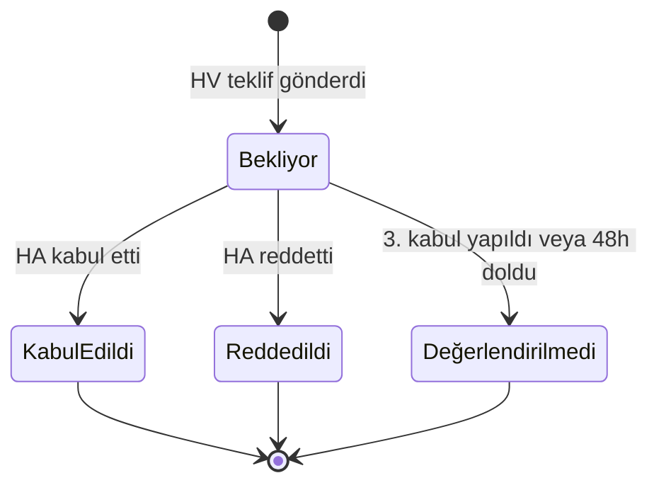

> Hizmet alanın gelen teklifleri değerlendirmesi, kabul etmesi ve karşılıklı telefon numarası paylaşımı akışı — talep başına maksimum 3 kabul.

## PRD Bölümleri

- [§8.3 Teklif Kabul Süreci](../../esnaaf-claude.md)

## Aktörler

| Aktör | Rol |
|---|---|
| [[Hizmet-Alan]] | Teklifi değerlendiren ve kabul eden taraf |
| [[Hizmet-Veren]] | Teklifi gönderen firma |

## Tetikleyici

HA, gelen teklifler listesinde bir teklifi inceleyip "Kabul Et" butonuna basar.

## Akış



## Kabul Kuralları

| Kural | Detay |
|---|---|
| Maksimum kabul | Talep başına **3 adet** |
| Telefon paylaşımı | Her kabulde karşılıklı telefon numaraları açılır |
| Onay zorunluluğu | Consent popup'ı → checkbox işaretlemeden kabul yapılamaz |
| 3. kabul sonrası | Kalan bekleyen teklifler → **"Değerlendirilmedi"** statüsüne geçer |

## Onay Popup'ı (Consent)

Kabul butonuna basıldığında zorunlu onay popup'ı gösterilir:

```
┌─────────────────────────────────────────────┐
│  Teklifi Kabul Et                           │
│                                             │
│  Bu teklifi kabul ettiğinizde telefon       │
│  numaranız firma ile paylaşılacaktır.       │
│                                             │
│  ☐ Telefon numaramın paylaşılmasını         │
│    onaylıyorum                              │
│                                             │
│  [İptal]              [Kabul Et]            │
└─────────────────────────────────────────────┘
```

- Checkbox işaretlenmeden "Kabul Et" butonu **devre dışı** kalır
- Consent kaydı `offer_acceptances` tablosuna `consent_given_at` olarak yazılır

## 3. Kabul Sonrası Davranış

3\. teklif kabul edildiğinde:

1. Kalan **bekleyen** teklifler otomatik olarak "Değerlendirilmedi" statüsüne geçer
2. Bu HV'lere bildirim: "Talep sahibi diğer firmaları tercih etti"
3. Talep artık yeni teklif almaz
4. Talep statüsü "Tamamlandı" olarak güncellenir

## Teklif Statü Geçişleri



| Statü | Açıklama |
|---|---|
| **Bekliyor** | HV teklif gönderdi, HA değerlendirmedi |
| **Kabul Edildi** | HA kabul etti, telefon numaraları paylaşıldı |
| **Reddedildi** | HA açıkça reddetti |
| **Değerlendirilmedi** | 3. kabul sonrası otomatik kapandı veya 48h doldu |

## Telefon Numarası Paylaşımı

Her kabul işleminde:

| Taraf | Gördüğü |
|---|---|
| HA | HV'nin gerçek telefon numarası |
| HV | HA'nın gerçek telefon numarası |

- Kabul öncesi: numaralar [[Telefon-Maskeleme]] ile gizli
- Kabul sonrası: karşılıklı açılır
- [[Telefon-Açma-Akışı]] detayları için ilgili sayfaya bakın

## Hata Senaryoları

| Senaryo | Davranış |
|---|---|
| 3. kabul zaten yapılmış | 400 → "Maksimum kabul sayısına ulaştınız" |
| Teklif artık geçerli değil (HV banlanmış) | 400 → "Bu teklif artık geçerli değil" |
| Talep süresi dolmuş (48h) | 400 → "Talep süresi dolmuş" |
| Concurrent kabul (race condition) | DB lock ile atomik kontrol |

## İlgili Sayfalar

- [[M3-Eşleştirme-Teklif]]
- [[Telefon-Maskeleme]]
- [[Telefon-Açma-Akışı]]
- [[Talep-Yaşam-Döngüsü]]
- [[Hizmet-Alan]]
- [[Hizmet-Veren]]
