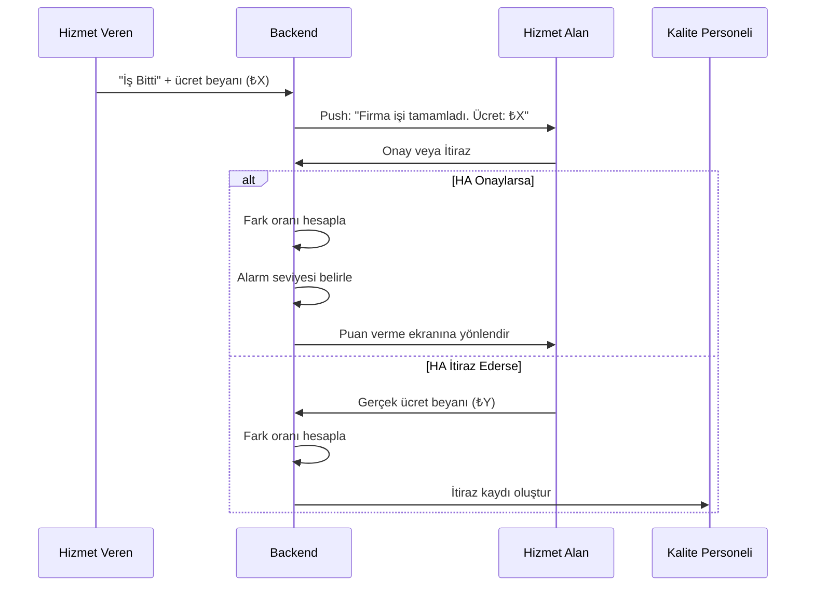

> Hizmet verenin iş bittikten sonra ücret beyan etmesi, hizmet alanın bu ücreti onaylaması veya itiraz etmesi ve fark alarmı mekanizması.

## PRD Bölümleri

- [§15.12 İş Bitiş Teyit Süreci](../../esnaaf-claude.md)

## Aktörler

| Aktör | Rol |
|---|---|
| [[Hizmet-Veren]] | İş bitimini ve ücreti beyan eden taraf |
| [[Hizmet-Alan]] | Ücreti onaylayan veya itiraz eden taraf |
| Kalite Personeli | Ücret farkı itirazlarını yöneten admin |

## Tetikleyici

HV, kabul edilmiş bir iş için "İş Bitti" butonuna basar.

## Akış



## Ücret Farkı Alarm Seviyeleri

HV'nin beyan ettiği ücret ile HA'nın onayladığı/beyan ettiği ücret arasındaki fark:

| Fark Oranı | Alarm Seviyesi | Aksiyon |
|---|---|---|
| **0%** | ✅ Normal | Kayıt tutulur, işlem tamamlanır |
| **1–15%** | ℹ️ Bilgi | Kayıt tutulur, raporlanır (aksiyon yok) |
| **16–30%** | 🟡 Sarı Alarm | Kalite personeline bildirim, takip listesine eklenir |
| **31%+** | 🔴 Kırmızı Alarm | Kalite personeline acil bildirim, HV dosyasına not düşülür |

### Fark Hesaplama

```
fark_orani = |HV_beyan - HA_beyan| / HA_beyan * 100
```

## HV İş Bitiş Beyanı

```
┌─────────────────────────────────────────┐
│  İş Tamamlama Formu                    │
│                                         │
│  Talep: Boya Badana — Kadıköy           │
│  Müşteri: Ali K.                        │
│                                         │
│  Alınan Ücret: [₺ ________]            │
│                                         │
│  Not (opsiyonel): [________________]    │
│                                         │
│  [İşi Tamamla]                          │
└─────────────────────────────────────────┘
```

## HA Teyit Ekranı

```
┌─────────────────────────────────────────┐
│  İş Tamamlama Teyidi                   │
│                                         │
│  Firma: ABC Boya                        │
│  Beyan edilen ücret: ₺2.500            │
│                                         │
│  Bu ücret doğru mu?                     │
│                                         │
│  [✓ Evet, doğru]  [✗ Hayır, farklı]   │
└─────────────────────────────────────────┘
```

### HA "Farklı" Seçerse

```
┌─────────────────────────────────────────┐
│  Gerçek Ücret                           │
│                                         │
│  Ödediğiniz ücret: [₺ ________]        │
│                                         │
│  Açıklama (opsiyonel): [____________]   │
│                                         │
│  [Gönder]                               │
└─────────────────────────────────────────┘
```

## Kalite Personeli İtiraz Yönetimi

Sarı veya kırmızı alarm oluştuğunda:

| Adım | Açıklama |
|---|---|
| 1 | Admin panelde "İtiraz Yönetimi" kuyruğuna düşer |
| 2 | Kalite personeli HA ve HV beyanlarını inceler |
| 3 | Gerekirse taraflarla iletişime geçer (telefon/mesaj) |
| 4 | Karar verir: HV uyarılır, HV cezalandırılır, veya itiraz reddedilir |
| 5 | Sonuç her iki tarafa bildirilir |

### İtiraz Kararları

| Karar | Etki |
|---|---|
| HV Uyarı | HV dosyasına uyarı notu, tekrarda ceza |
| HV Ceza | Geçici askıya alma veya puan düşürme |
| İtiraz Reddi | HA'ya "Fark makul aralıkta" bildirimi |

## İş Bitiş Sonrası

Onay tamamlandıktan sonra:

1. Talep statüsü "Tamamlandı" olarak güncellenir
2. HA'ya [[Puan-Verme-Akışı]] tetiklenir (24 saat içinde puan verme)
3. NPS anketi planlanır (7 gün sonra)
4. İş kaydı raporlama için arşivlenir

## İlgili Sayfalar

- [[M5-Puan-Şikayet-NPS]]
- [[M6-Admin-Roller]]
- [[Puan-Verme-Akışı]]
- [[Talep-Yaşam-Döngüsü]]
- [[Hizmet-Alan]]
- [[Hizmet-Veren]]
