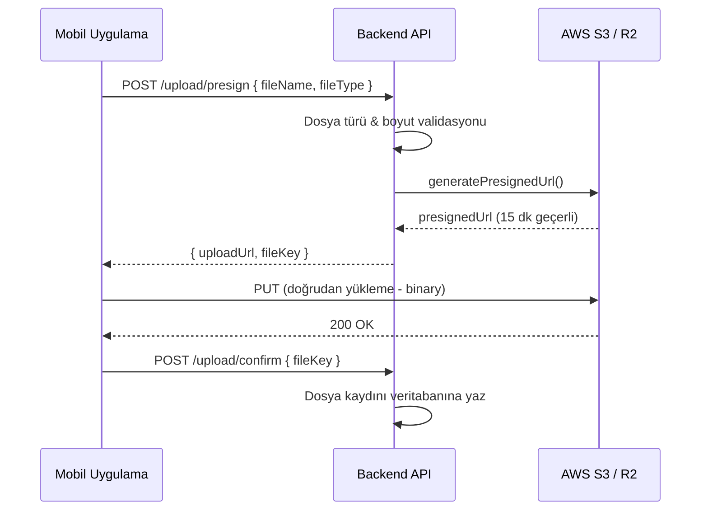
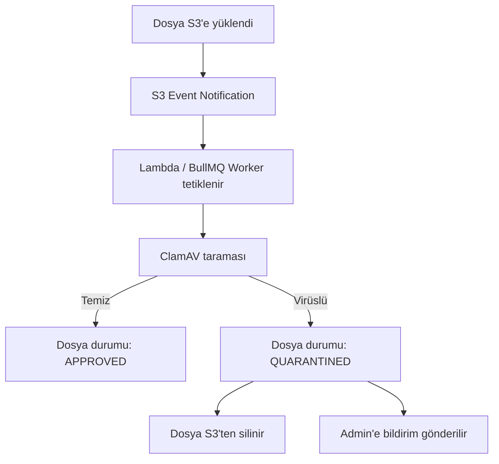

> Dosya yükleme güvenlik mimarisi — S3 presigned URL ile doğrudan yükleme, dosya kısıtlamaları ve virüs taraması.

## PRD Referansları

- [§17.3 — Dosya Yükleme Güvenliği](../../esnaaf-claude.md) — Dosya yükleme mimarisi ve güvenlik kuralları

## Mimari Genel Bakış



### Temel Prensipler

| Prensip | Açıklama |
|---------|----------|
| **Backend proxy yok** | Dosyalar doğrudan frontend → S3 yüklenir (backend bant genişliği korunur) |
| **Presigned URL** | 15 dakika geçerli, tek kullanımlık imzalı URL |
| **Private bucket** | Herkese açık URL yok — dosya erişimi her zaman API üzerinden |
| **Validasyon iki katmanlı** | Hem backend (presign aşaması) hem S3 (bucket policy) |

## Dosya Kısıtlamaları

| Kısıt | Değer | Açıklama |
|-------|-------|----------|
| **İzin verilen formatlar** | JPG, PNG, PDF | Sadece görsel ve belge dosyaları |
| **Minimum boyut** | — | Boş dosya kabul edilmez |
| **Maksimum boyut** | 2-5 MB | Dosya türüne göre değişir |
| **Dosya adı** | UUID ile yeniden adlandırılır | Orijinal dosya adı saklanmaz (güvenlik) |

### Boyut Limitleri (Dosya Türüne Göre)

| Dosya Türü | Maksimum Boyut | Kullanım Alanı |
|------------|---------------|----------------|
| **Profil fotoğrafı** | 2 MB | HA/HV profil görseli |
| **Kimlik belgesi** | 5 MB | HV onay süreci belgeleri |
| **Vergi levhası** | 5 MB | HV onay süreci belgeleri |
| **Değerlendirme görseli** | 2 MB | HA değerlendirme eki |
| **Sohbet eki** | 2 MB | Mesajlaşma dosya paylaşımı |

## Presigned URL Detayları

```typescript
// upload.service.ts
async generatePresignedUrl(dto: PresignDto): Promise<PresignResponse> {
  // 1. Dosya türü validasyonu
  const allowedTypes = ['image/jpeg', 'image/png', 'application/pdf'];
  if (!allowedTypes.includes(dto.fileType)) {
    throw new BadRequestException('Desteklenmeyen dosya türü');
  }

  // 2. Benzersiz dosya anahtarı oluştur
  const fileKey = `${dto.category}/${uuidv4()}.${getExtension(dto.fileType)}`;

  // 3. Presigned URL üret (15 dk geçerli)
  const command = new PutObjectCommand({
    Bucket: process.env.S3_BUCKET,
    Key: fileKey,
    ContentType: dto.fileType,
    ContentLength: dto.fileSize,  // Boyut kısıtlaması
  });

  const uploadUrl = await getSignedUrl(s3Client, command, {
    expiresIn: 900, // 15 dakika
  });

  return { uploadUrl, fileKey };
}
```

## Bucket Yapısı

```
esnaaf-uploads/
├── profiles/               # Profil fotoğrafları
│   └── {uuid}.jpg
├── identity-docs/           # Kimlik belgeleri (HV onay)
│   └── {uuid}.pdf
├── tax-docs/                # Vergi levhaları (HV onay)
│   └── {uuid}.pdf
├── review-attachments/      # Değerlendirme ekleri
│   └── {uuid}.jpg
└── chat-attachments/        # Sohbet dosya ekleri
    └── {uuid}.png
```

## Güvenlik Katmanları

### 1. Presign Aşaması (Backend)
- Dosya türü kontrolü (whitelist)
- Dosya boyutu kontrolü
- Kullanıcı kimlik doğrulama (JWT)
- Rate limiting (10 istek/dakika)

### 2. Bucket Policy (S3)
- Yalnızca presigned URL ile yazma izni
- Public erişim tamamen kapalı
- CORS sadece uygulama domain'lerine açık
- Server-side encryption (AES-256)

### 3. Erişim Kontrolü (Backend)
- Dosya erişimi her zaman API üzerinden (geçici signed URL ile)
- Erişim yetki kontrolü: dosya sahibi veya ilgili taraf
- Erişim logları tutulur

## Virüs Taraması (Phase 3)

> ⚠️ ClamAV entegrasyonu **Phase 3** kapsamında planlanmıştır. MVP'de aktif değildir.

### Planlanan Akış



### Dosya Durumları

| Durum | Açıklama |
|-------|----------|
| `PENDING` | Yüklendi, tarama bekliyor |
| `APPROVED` | Tarama temiz, kullanıma hazır |
| `QUARANTINED` | Virüs tespit edildi, karantinaya alındı |
| `DELETED` | Silinmiş dosya |

## Saklama Süreleri

| Dosya Türü | Saklama Süresi | Silme Politikası |
|------------|---------------|------------------|
| **Değerlendirme belgeleri** | 2 yıl | Süre sonunda otomatik silme (S3 lifecycle rule) |
| **HV kimlik belgeleri** | 5 yıl | Yasal zorunluluk — süre sonunda silme |
| **Profil fotoğrafları** | Üyelik süresince | Hesap silindiğinde silinir |
| **Sohbet ekleri** | 2 yıl | İletişim logları ile aynı politika |

### S3 Lifecycle Rules

```json
{
  "Rules": [
    {
      "ID": "delete-review-docs-after-2-years",
      "Filter": { "Prefix": "review-attachments/" },
      "Status": "Enabled",
      "Expiration": { "Days": 730 }
    },
    {
      "ID": "delete-identity-docs-after-5-years",
      "Filter": { "Prefix": "identity-docs/" },
      "Status": "Enabled",
      "Expiration": { "Days": 1825 }
    }
  ]
}
```

## Environment Değişkenleri

```env
S3_BUCKET=esnaaf-uploads
S3_REGION=eu-central-1
S3_ACCESS_KEY=<access-key>
S3_SECRET_KEY=<secret-key>
S3_ENDPOINT=<r2-endpoint>    # Cloudflare R2 kullanılıyorsa
UPLOAD_MAX_SIZE_MB=5
UPLOAD_PRESIGN_TTL=900       # 15 dakika (saniye)
```

## İlgili Sayfalar

- [[M7-Altyapı]] — Altyapı modülü detayları
- [[Stack]] — Teknoloji yığını (AWS S3 / Cloudflare R2)
- [[KVKK-Veri-Saklama]] — Veri saklama süreleri
- [[Rate-Limit]] — Dosya yükleme rate limit kuralları
