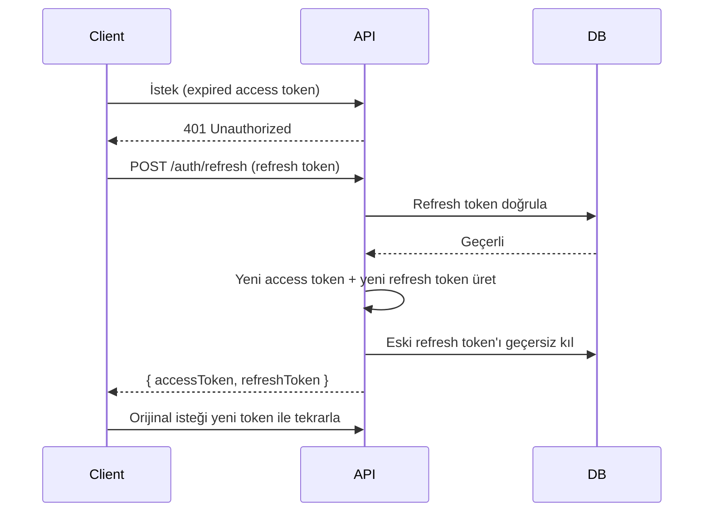

> JWT (JSON Web Token) tabanlı kimlik doğrulama yapısı — access/refresh token mekanizması, roller ve güvenlik kuralları.

## PRD Referansları

- [§17 — Güvenlik & Uyumluluk](../../esnaaf-claude.md) — JWT token yapılandırması ve güvenlik gereksinimleri

## Token Yapısı

### Access Token

| Özellik | Değer |
|---------|-------|
| **TTL (Geçerlilik Süresi)** | 15 dakika |
| **Algoritma** | HS256 / RS256 |
| **Taşıyıcı** | `Authorization: Bearer <token>` header |
| **İçerik** | `userId`, `role`, `iat`, `exp` |

### Refresh Token

| Özellik | Değer |
|---------|-------|
| **TTL (Geçerlilik Süresi)** | 7 gün |
| **Saklama** | HttpOnly cookie veya secure storage (mobil) |
| **Kullanım** | Yeni access token almak için |
| **Rotasyon** | Her kullanımda yeni refresh token üretilir |

## Roller (Token Payload)

Token içindeki `role` alanı aşağıdaki değerlerden birini alır:

| Rol | Açıklama | Uygulama |
|-----|----------|----------|
| `service_seeker` | Hizmet Alan (HA / Müşteri) | app-musteri |
| `service_provider` | Hizmet Veren (HV / Usta) | app-hizmetveren |
| `admin` | Tam yetkili admin | Admin panel |
| `staff` | Kısıtlı yetkili personel | Admin panel (sınırlı) |

## Token Payload Örneği

```json
{
  "sub": "usr_abc123",
  "role": "service_seeker",
  "iat": 1716580800,
  "exp": 1716581700
}
```

## Token Yenileme Akışı



## Güvenlik Kuralları

| Kural | Uygulama |
|-------|----------|
| **Token rotasyonu** | Her refresh işleminde eski token geçersiz kılınır (replay attack önleme) |
| **Blacklist** | Logout yapıldığında refresh token Redis blacklist'e eklenir |
| **Cihaz bazlı** | Her cihaz için ayrı refresh token (çoklu cihaz desteği) |
| **Rate limit** | Refresh endpoint'i rate limit altında (bkz: [[Rate-Limit]]) |
| **HTTPS zorunlu** | Tüm token iletişimi HTTPS üzerinden |
| **Minimum payload** | Token'da hassas bilgi (telefon, e-posta) tutulmaz |

## Logout İşlemi

1. Client, `POST /auth/logout` endpoint'ine refresh token gönderir
2. Backend, refresh token'ı Redis blacklist'e ekler (TTL = kalan süre)
3. İlişkili tüm cihaz token'ları geçersiz kılınır (opsiyonel: "tüm cihazlardan çıkış")

## Environment Değişkenleri

```env
JWT_SECRET=<güçlü-rastgele-string>
JWT_ACCESS_TTL=15m
JWT_REFRESH_TTL=7d
```

## NestJS Guard Yapısı

```typescript
// common/guards/jwt-auth.guard.ts
@Injectable()
export class JwtAuthGuard extends AuthGuard('jwt') {}

// common/guards/roles.guard.ts
@Injectable()
export class RolesGuard implements CanActivate {
  canActivate(context: ExecutionContext): boolean {
    const requiredRoles = this.reflector.get<string[]>('roles', context.getHandler());
    const { role } = context.switchToHttp().getRequest().user;
    return requiredRoles.includes(role);
  }
}

// Kullanım
@UseGuards(JwtAuthGuard, RolesGuard)
@Roles('service_provider', 'admin')
@Get('dashboard')
getDashboard() { ... }
```

## İlgili Sayfalar

- [[M1-Auth-Kullanıcı]] — Kimlik doğrulama ve kullanıcı yönetimi modülü
- [[Rate-Limit]] — API rate limiting kuralları
- [[Stack]] — Teknoloji yığını
- [[KVKK-Veri-Saklama]] — Veri saklama ve gizlilik
