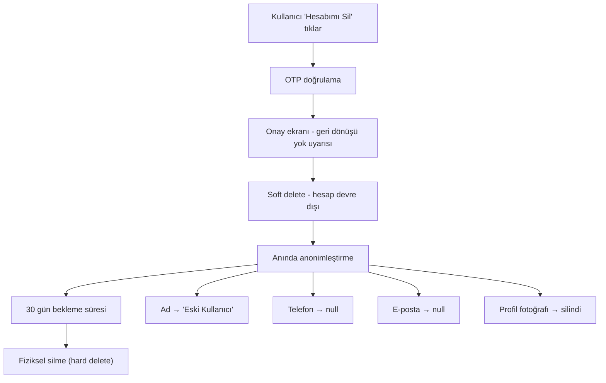

> KVKK (Kişisel Verilerin Korunması Kanunu) kapsamında veri saklama süreleri, kullanıcı hakları ve hesap silme prosedürü.

## PRD Referansları

- [§12 — KVKK & Yasal Uyumluluk](../../esnaaf-claude.md) — Veri saklama politikaları ve yasal yükümlülükler

## Veri Saklama Süreleri

| Veri Türü | Saklama Süresi | Yasal Dayanak | Açıklama |
|-----------|---------------|---------------|----------|
| **Hesap bilgileri** | Üyelik + 3 yıl | KVKK Md. 7, TTK | Ad, soyad, telefon, e-posta — üyelik bitişinden itibaren 3 yıl |
| **Ödeme / Fatura kayıtları** | 10 yıl | TTK Md. 82 | İyzico işlem kayıtları, fatura bilgileri, abonelik geçmişi |
| **İletişim logları** | 2 yıl | KVKK | Mesajlaşma geçmişi, bildirim logları, AI sohbet kayıtları |
| **Değerlendirmeler** | Üyelik süresince | KVKK | Üyelik sonlandığında anonimleştirilir |
| **Telefon ifşa logları** | 2 yıl | KVKK | Hangi HA'nın hangi HV telefonunu gördüğünün kaydı |
| **OTP / Giriş logları** | 6 ay | Güvenlik politikası | IP adresi, cihaz bilgisi, giriş zamanı |
| **Dosya yüklemeleri (belgeler)** | Türüne göre değişir | KVKK | Değerlendirme belgeleri 2 yıl, HV kimlik belgeleri 5 yıl |

## Kullanıcı Hakları (KVKK Md. 11)

KVKK kapsamında her kullanıcının sahip olduğu haklar:

| Hak | Açıklama | Uygulama |
|-----|----------|----------|
| **Erişim hakkı** | Kişisel verilerin işlenip işlenmediğini öğrenme | Profil sayfasından "Verilerimi Görüntüle" |
| **Düzeltme hakkı** | Eksik veya yanlış verilerin düzeltilmesini talep etme | Profil düzenleme ekranı |
| **Silme hakkı** | Kişisel verilerin silinmesini talep etme | "Hesabımı Sil" özelliği |
| **İtiraz hakkı** | İşlenen verilerin aleyhine sonuç çıkmasına itiraz | Destek talebi üzerinden |
| **Taşınabilirlik hakkı** | Kişisel verileri yapılandırılmış formatta alma | JSON/CSV dışa aktarma |

## Hesap Silme Prosedürü

### Kullanıcı Tarafından Tetiklenen Silme



### Anonimleştirme Detayları

| Alan | İşlem | Sonuç |
|------|-------|-------|
| **Ad Soyad** | Anonimleştirme | `"Eski Kullanıcı"` |
| **Telefon numarası** | Silme | `null` |
| **E-posta** | Silme | `null` |
| **Profil fotoğrafı** | S3'ten silme | `null` |
| **Adres bilgileri** | Silme | `null` |
| **Değerlendirmeler** | Anonimleştirme | Yazar: `"Eski Kullanıcı"` olarak kalır |
| **Mesajlar** | Anonimleştirme | Gönderen: `"Eski Kullanıcı"` |

### Zamanlama

| Adım | Süre | Açıklama |
|------|------|----------|
| Soft delete | Anında | Hesap devre dışı, giriş yapılamaz |
| Anonimleştirme | Anında | Kişisel veriler anında maskelenir |
| Bekleme süresi | 30 gün | Kullanıcı geri dönmek isterse |
| Fiziksel silme | 30 gün sonra | Tüm kayıtlar veritabanından kalıcı olarak silinir |

### Silinmeyen Veriler

Yasal zorunluluk nedeniyle hesap silme sonrası da saklanan veriler:

| Veri | Saklama Süresi | Gerekçe |
|------|---------------|---------|
| Fatura kayıtları | 10 yıl | TTK Md. 82 zorunluluğu |
| Ödeme işlem logları | 10 yıl | Mali düzenleme |
| Şikâyet kayıtları | Çözüm + 1 yıl | Hukuki süreç |

## KVKK Onay Mekanizması

Kullanıcıdan alınan onaylar:

| Onay Türü | Zorunlu | Alınma Zamanı |
|-----------|---------|---------------|
| **Açık rıza** | Evet | Kayıt sırasında |
| **Aydınlatma metni** | Evet | Kayıt sırasında (okuma onayı) |
| **Ticari ileti izni** | Hayır | Kayıt sırasında (opsiyonel) |
| **Çerez politikası** | Evet | Web ilk ziyarette |

> Detaylı onay akışı için bkz: [[KVKK-Onay-Akışı]]

## Teknik Uygulama

### Veri Silme Cron Job'ları

```typescript
// BullMQ cron job — her gün 03:00'te çalışır
@Cron('0 3 * * *')
async processAccountDeletions() {
  // 30 günü geçmiş soft-deleted hesapları fiziksel olarak sil
  const expiredAccounts = await this.prisma.user.findMany({
    where: {
      deletedAt: { lte: subDays(new Date(), 30) },
      status: 'SOFT_DELETED',
    },
  });
  
  for (const account of expiredAccounts) {
    await this.hardDeleteAccount(account.id);
  }
}
```

### Veri Saklama Süresi Kontrol Tablosu

```sql
-- retention_policies tablosu
CREATE TABLE retention_policies (
  id          SERIAL PRIMARY KEY,
  data_type   VARCHAR(50) NOT NULL,
  retention   INTERVAL NOT NULL,
  legal_basis VARCHAR(100),
  created_at  TIMESTAMP DEFAULT NOW()
);

INSERT INTO retention_policies VALUES
  (1, 'account_info',     '3 years',  'KVKK Md. 7'),
  (2, 'payment_records',  '10 years', 'TTK Md. 82'),
  (3, 'communication_logs','2 years', 'KVKK'),
  (4, 'phone_reveal_logs','2 years',  'KVKK'),
  (5, 'otp_logs',         '6 months', 'Güvenlik politikası');
```

## İlgili Sayfalar

- [[KVKK-Onay-Akışı]] — KVKK onay alma ve yönetme akışı
- [[M1-Auth-Kullanıcı]] — Kimlik doğrulama ve kullanıcı yönetimi
- [[Dosya-Yükleme]] — Dosya yükleme ve saklama kuralları
- [[Hizmet-Alan]] — Hizmet alan kullanıcı rolü
- [[Hizmet-Veren]] — Hizmet veren kullanıcı rolü
